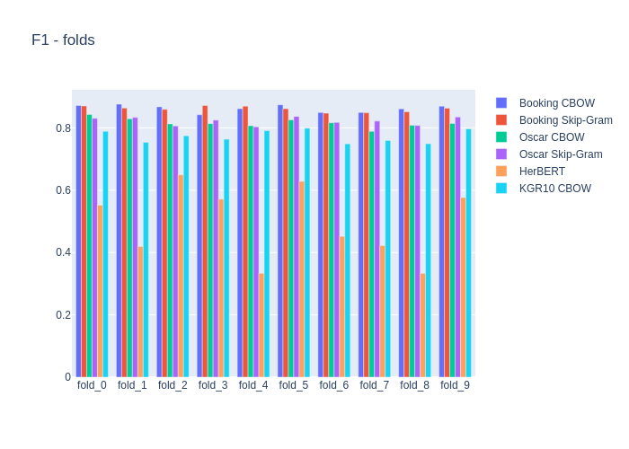

# Language corporas

This exercise focused on measuring performance of classification task using embedding models trained on different language corporas.
Binary classification (pos/neg) of Booking.com reviews (>100k) was chosen as a task.

Co-author: [MrMiodek](https://github.com/MrMiodek)

## Classification models
- Simple MLP
- LSTM based
- Convolution based

## Embedding models
- CBOW
- SKIP-GRAM
- HerBERT

## Corporas
- Oscar
- KGR10
- Booking reviews

## Results

#### Detailed MLP

#### All

# Transfer learning

Part of the exercise was to try transfer learning between languages (pl, en) in different configurations on the same task (MLP).

## Results

